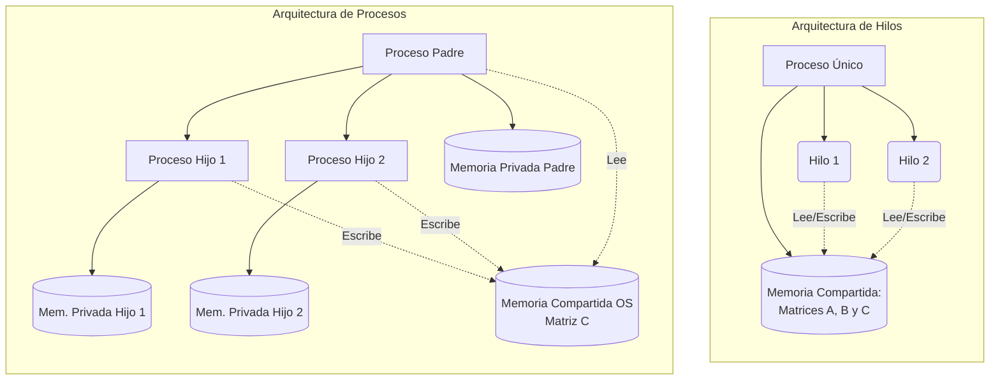
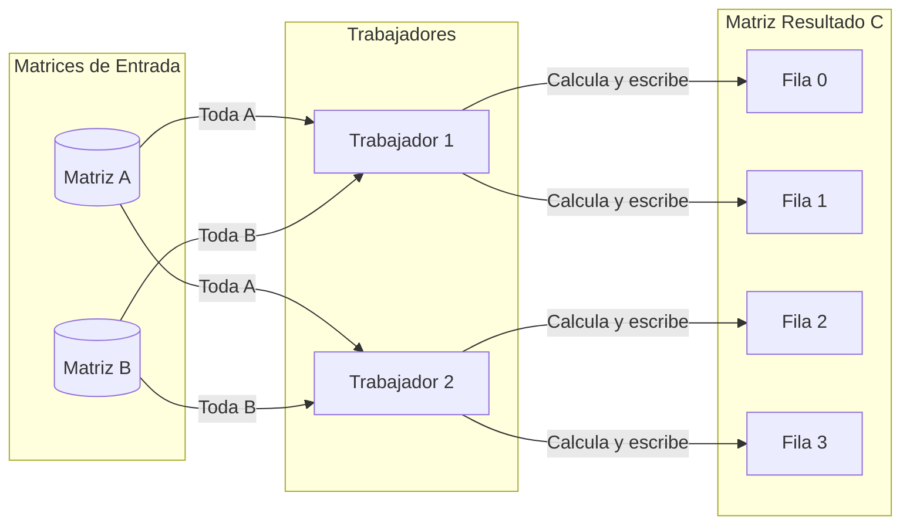

# Concurrencia y Paralelismo: Hilos vs Procesos

Esta guía explora las diferencias fundamentales entre la ejecución secuencial y las implementaciones paralelas utilizando **Hilos (Threads)** y **Procesos (Processes)**, tomando como base el problema matemático de la multiplicación de matrices.

---

## 1. Conceptos Fundamentales

Antes de analizar el código, es vital entender cómo el Sistema Operativo gestiona la memoria para estas dos unidades de ejecución.

### ¿Qué es un Proceso?

Un proceso es un programa en ejecución. Cuando un proceso se clona (mediante la llamada `fork` en sistemas POSIX), el sistema operativo crea una **copia exacta y aislada** del espacio de memoria (Address Space).

* Lo que el "Proceso Hijo" modifique en su memoria, no afectará al "Proceso Padre".
* Para que padre e hijo colaboren en generar un resultado, se requieren mecanismos de Comunicación Inter-Proceso (IPC) como tuberías (pipes) o **Memoria Compartida (Shared Memory)**.

### ¿Qué es un Hilo (Thread)?

Un hilo es una unidad de ejecución más ligera que **vive dentro de un proceso**.

* Múltiples hilos creados por un mismo proceso **comparten el mismo espacio de memoria** global (variables globales, heap, código), aunque cada uno tiene su propia Pila (Stack) para variables locales.
* Esto hace que compartir datos sea automático y muy rápido, pero obliga a tener cuidado con las *Condiciones de Carrera* (Race Conditions) si varios hilos intentan escribir en el mismo lugar al mismo tiempo.



---

## 2. El Problema: Multiplicación de Matrices

Multiplicar dos matrices ($A \times B = C$) de tamaño $N \times N$ tiene una complejidad de $O(N^3)$. Esto significa que por cada elemento en $C$, hay que multiplicar y sumar $N$ elementos de una fila de $A$ por una columna de $B$.

### ¿Cómo funciona la multiplicación matemática?

Para calcular el valor que va en una posición específica de la matriz Resultado $C$ (por ejemplo, fila 1, columna 1), necesitamos tomar **toda la fila 1 de la Matriz A** y multiplicarla punto a punto contra **toda la columna 1 de la Matriz B**, sumando finalmente esos valores.

**Esquema Visual (Matriz 3x3):**

```text
   Matriz A (Filas)         Matriz B (Columnas)         Matriz C (Resultado)
[ a11  a12  a13 ]         [ b11  b12  b13 ]         [ c11  c12  c13 ]
[ a21  a22  a23 ]    X    [ b21  b22  b23 ]    =    [ c21  c22  c23 ]
[ a31  a32  a33 ]         [ b31  b32  b33 ]         [ c31  c32  c33 ]

Ejemplo de cálculo para c11 (Fila 1 x Columna 1):
c11 = (a11 * b11) + (a12 * b21) + (a13 * b31)

Ejemplo de cálculo para c23 (Fila 2 x Columna 3):
c23 = (a21 * b13) + (a22 * b23) + (a23 * b33)
```

### Estrategia de Paralelización (División del Trabajo)

> [!TIP]
> Dado que el cálculo de `c11` es completamente independiente del cálculo de `c23`, este es un problema "Vergonzosamente Paralelizable" (*Embarrassingly parallel*).

Nuestra estrategia en el código C consiste en **dividir las filas de la matriz resultante entre los diferentes trabajadores**. 

**Esquema de Reparto (Ejemplo 4 Filas, 2 Trabajadores):**


Al repartir responsabilidades por filas enteras, garantizamos que dos trabajadores **nunca intenten escribir en la misma posición de la memoria al mismo tiempo**. Esto elimina el riesgo de condiciones de carrera (Race Conditions) y evita la necesidad de usar candados (`Mutex`), optimizando al máximo la velocidad.

---

## 3. Implementación Secuencial

El enfoque tradicional. Un solo trabajador recorre toda la matriz.

### Pseudocódigo Secuencial

```text
Función multiplicar_secuencial(A, B, C, N):
    Para i desde 0 hasta N-1:
        Para j desde 0 hasta N-1:
            suma = 0
            Para k desde 0 hasta N-1:
                suma = suma + (A[i][k] * B[k][j])
            C[i][j] = suma
```

### Implementación en C

```c
void multiply_sequential(int *A, int *B, int *C, int n) {
    for (int i = 0; i < n; i++) {           // Filas
        for (int j = 0; j < n; j++) {       // Columnas
            int sum = 0;
            for (int k = 0; k < n; k++) {   // Elementos
                sum += A[i * n + k] * B[k * n + j];
            }
            C[i * n + j] = sum;
        }
    }
}
```

---

## 4. Implementación con Hilos (Pthreads)

Dividimos la matriz $C$ en bloques de filas. Si $N=100$ y tenemos $4$ hilos, el Hilo 0 calcula las filas 0-24, el Hilo 1 las filas 25-49, etc.

> [!NOTE]
> Como los hilos comparten el _Heap_ del proceso, las matrices asignadas con `malloc` en la función principal (`main`) son visibles directamente para todos los hilos.

### Pseudocódigo (Hilos)

```text
Estructura ArgumentosHilo:
    inicio_fila, fin_fila, A, B, C, N

Función trabajador_hilo(argumentos):
    Para i desde inicio_fila hasta fin_fila - 1:
        Para j desde 0 hasta N-1:
            suma = 0
            Para k desde 0 hasta N-1:
                suma = suma + (A[i][k] * B[k][j])
            C[i][j] = suma

Función principal_hilos:
    Crear arreglo de N_HILOS
    filas_por_hilo = N / N_HILOS
  
    Para cada hilo 'h':
        argumentos.inicio_fila = h * filas_por_hilo
        argumentos.fin_fila = (h + 1) * filas_por_hilo
        Crear_Hilo(trabajador_hilo, argumentos)
  
    Esperar_A_Todos_Los_Hilos() // Join
```

### Implementación en C

```c
void *thread_worker(void *arg) {
    ThreadData *data = (ThreadData *)arg; // Desempaquetar argumentos
    int n = MATRIX_SIZE;
  
    for (int i = data->start_row; i < data->end_row; i++) {
        for (int j = 0; j < n; j++) {
            int sum = 0;
            for (int k = 0; k < n; k++) {
                sum += data->A[i * n + k] * data->B[k * n + j];
            }
            data->C[i * n + j] = sum; // Escritura directa!
        }
    }
    return NULL;
}
```

---

## 5. Implementación con Procesos (Fork)

Al clonar el proceso con `fork()`, el hijo obtiene una copia de las matrices $A$ y $B$. Sin embargo, si el hijo escribiera en un puntero $C$ reservado con `malloc`, estaría escribiendo en **su propia copia** aislada, y el padre no vería los resultados.

> [!IMPORTANT]
> Para solucionar esto, el arreglo de memoria para el resultado $C$ debe solicitarse explícitamente al Sistema Operativo como **Memoria Compartida Anónima** usando la llamada al sistema `mmap`.

### Pseudocódigo (Procesos)

```text
Función principal_procesos:
    // Mapear memoria especial compartida entre padre e hijos
    C_compartida = mmap(tamaño) 
    filas_por_proceso = N / N_PROCESOS

    Para 'p' desde 0 hasta N_PROCESOS - 1:
        PID = fork() // Clona el proceso
      
        Si PID == 0: // Soy el proceso HIJO
            inicio_fila = p * filas_por_proceso
            fin_fila = (p + 1) * filas_por_proceso
          
            Para i desde inicio_fila hasta fin_fila - 1:
                Para j desde 0 hasta N-1:
                    suma = 0
                    Para k desde 0 hasta N-1:
                        suma = suma + (A[i][k] * B[k][j])
                    C_compartida[i][j] = suma // Modifica memoria compartida
                  
            Salir() // El hijo DEBE morir aquí para no crear más hijos (Bomba Fork)
          
    // Soy el proceso PADRE
    Esperar_A_Todos_Los_Hijos() // Wait
```

### Implementación en C

```c
// Previamente en el main:
// int *C_shared = mmap(NULL, size, PROT_READ|PROT_WRITE, MAP_SHARED|MAP_ANONYMOUS, -1, 0);

void multiply_processes(int *A, int *B, int *C_shared, int n, int num_procs) {
    int rows_per_proc = n / num_procs;

    for (int i = 0; i < num_procs; i++) {
        pid_t pid = fork();
      
        if (pid == 0) { // Bloque exclusivo del Proceso Hijo
            int start_row = i * rows_per_proc;
            int end_row = (i + 1) * rows_per_proc;

            for (int r = start_row; r < end_row; r++) {
                for (int c = 0; c < n; c++) {
                    int sum = 0;
                    for (int k = 0; k < n; k++) {
                        sum += A[r * n + k] * B[k * n + c];
                    }
                    C_shared[r * n + c] = sum; // Visible por el padre
                }
            }
            exit(0); // Destruye el hijo al terminar su labor
        }
    }
    // Bloque exclusivo del Padre
    for (int i = 0; i < num_procs; i++) {
        wait(NULL); // Esperar que cada hijo haga exit(0)
    }
}
```

---

## 6. Efecto de la Escabilidad: ¿Más trabajadores siempre es mejor?

Al modificar el número de trabajadores (hilos o procesos), podríamos pensar intuitivamente que "a mayor cantidad, menor tiempo de ejecución". Sin embargo, el comportamiento real está regido por la **Arquitectura del Hardware** y las **Leyes de la Computación Paralela (Ley de Amdahl)**.

### Escenarios al variar el número de trabajadores:

1. **Subutilización (Pocos trabajadores, ej: 1 o 2)**:
   Si tienes un procesador de 8 núcleos pero solo lanzas 2 hilos, 6 núcleos estarán inactivos (ociosos). El rendimiento mejorará respecto al secuencial, pero no se aprovechará todo el potencial del hardware.

2. **Equilibrio Ideal (Trabajadores ≈ Núcleos Físicos/Lógicos)**:
   Si tu máquina tiene 8 núcleos lógicos y configuras 8 trabajadores, el rendimiento suele llegar a su pico máximo (Speedup óptimo). Cada trabajador se asigna a un núcleo dedicado y operan de forma ininterrumpida sin competir entre sí.

3. **Sobrecarga (Demasiados trabajadores, ej: 1000 hilos en 4 núcleos)**:
   Lanzar miles de hilos para paralelizar más no hará que el código sea más rápido, por el contrario, **lo hará mucho más lento**. Esto se debe a dos grandes problemas:
   * **Cambio de Contexto (Context Switching)**: El Sistema Operativo tiene que pausar y reanudar los hilos constantemente para que todos "compartan" los 4 núcleos. Guardar y cargar el estado de la CPU consume ciclos de reloj que se desperdician en administración en lugar de hacer cálculos matemáticos.
   * **Overhead de Creación**: Especialmente en los Procesos (`fork`), crear 1000 procesos exige que el SO duplique tablas de páginas de memoria 1000 veces. El tiempo gastado creando los procesos terminará siendo mayor que el tiempo de cálculo.

> [!WARNING]
> En la concurrencia hay un límite teórico. La **Ley de Amdahl** dicta que la aceleración máxima de un programa está limitada por su porción secuencial (la parte que no se puede paralelizar, como la inicialización de memoria, o el proceso de sincronización).

---

## Resumen y Conclusiones

| Característica                        | Secuencial         | Hilos (`pthreads`)             | Procesos (`fork`)                                |
| :------------------------------------- | :----------------- | :------------------------------- | :------------------------------------------------- |
| **Aislamiento**                  | Total              | Nulo (riesgo de corromper datos) | Alto (seguro, memoria aislada por defecto)         |
| **Compartición de Datos**       | Fácil (1 proceso) | Automática (variables globales) | Compleja (Requiere`mmap`, `shmget`, tuberías) |
| **Peso de Creación (Overhead)** | Ninguno            | Ligero (rápido de crear)        | Pesado (clona tablas de paginación del OS)        |
| **Rendimiento Multinúcleo**     | No                 | Sí                              | Sí                                                |

En la práctica docente y laboral, la regla de oro es: **Se usan Hilos** cuando las tareas deben cooperar fuertemente y compartir mucha información constantemente. **Se usan Procesos** cuando se ejecutan tareas independientes o de alto riesgo que no deben tumbar a la aplicación principal si sufren un error fatal (ej. navegadores web como Google Chrome, que asignan una pestaña a un proceso distinto).
