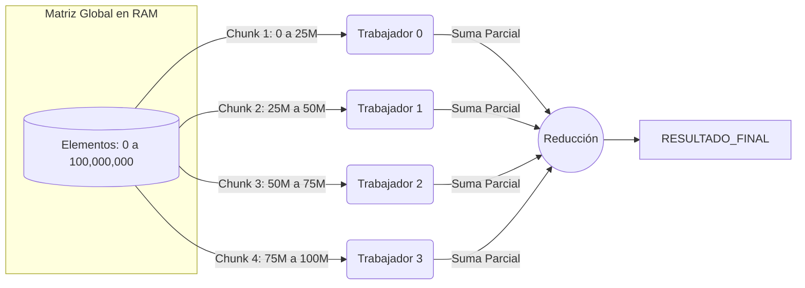
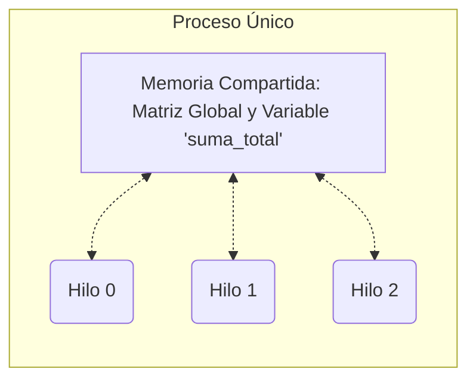
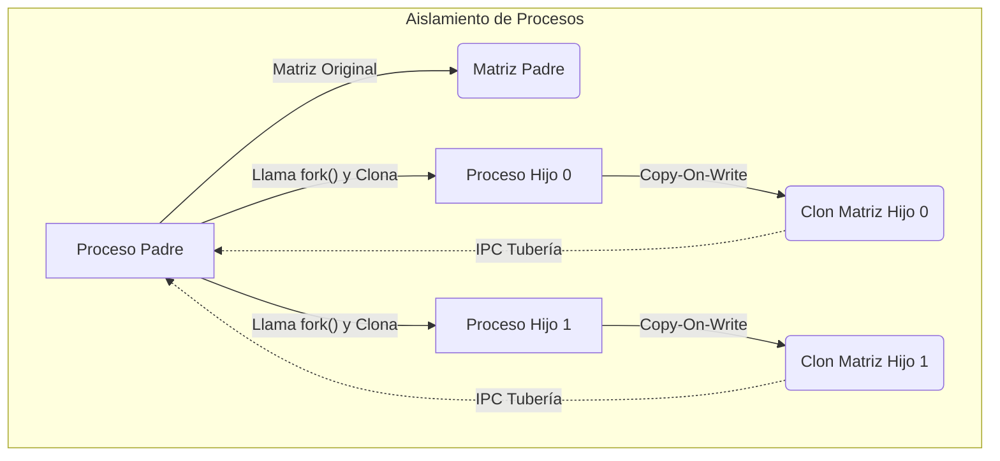

# Hilos vs Procesos: Teoría, Aplicación Matemática y Ejemplos de Código

Este documento analiza en profundidad el comportamiento de **Hilos (Threads)** y **Procesos** en los Sistemas Operativos, utilizando como caso de estudio las operaciones matemáticas intensivas sobre grandes matrices (sumas, multiplicaciones escalares y rotaciones).

---

## 1. El Problema Matemático (Partición de Datos)

Imaginemos que tenemos una matriz dinámica gigante, por ejemplo de **100 millones de elementos**. Para acelerar una operación como la sumatoria total, debemos aplicar una estrategia de **Mapeo y Reducción (MapReduce)** dividiendo el arreglo en *Chunks* (fragmentos) y asignándolos a distintos "Trabajadores" (Workers) de la CPU.



El desafío en la concurrencia es **¿Cómo se recolectan las sumas parciales hacia el "Resultado Final"?** Las reglas cambian drásticamente si esos "Trabajadores" son Hilos o son Procesos.

---

## 2. Paradigma de Hilos (Memoria Compartida)

Los hilos (creados con librerías como `pthreads` en C) operan dentro de un mismo proceso maestro. **Todos los hilos comparten el mismo puntero a la memoria RAM**.

### Esquema de Memoria



### El Problema de los Hilos: Condiciones de Carrera (Race Conditions)

Si el Hilo 0 y el Hilo 1 terminan su cálculo matemático exactamente en el mismo nanosegundo e intentan sumar su resultado a la variable global `suma_total`, el valor se sobrescribirá corruptamente.
Para evitarlo, se utiliza un **Mutex** (Semáforo binario) para crear una **Sección Crítica**.

### Pseudocódigo en C (Pthreads)
Para entender la **sincronización**, no basta con ver la función del trabajador. Debemos ver cómo el hilo principal (`main`) crea los múltiples hilos paralelos y luego se sincroniza con ellos esperando a que terminen.

```c
#include <pthread.h>
#define NUM_HILOS 4

// 1. Memoria Compartida
int* matriz_global;
long long suma_total = 0;
pthread_mutex_t mutex = PTHREAD_MUTEX_INITIALIZER; // Semáforo

typedef struct {
    int inicio;
    int fin;
} Rango;

// 2. Función Trabajadora (Lo que hace cada Hilo)
void* trabajador_hilo(void* arg) {
    Rango* rango = (Rango*) arg;
    
    // Mapeo: Cálculo pesado puramente local (SIN BLOQUEOS)
    long long suma_local = 0;
    for (int i = rango->inicio; i < rango->fin; i++) {
        suma_local += matriz_global[i];
    }
    
    // Reducción: SECCIÓN CRÍTICA sincronizada por Mutex
    pthread_mutex_lock(&mutex);       // <-- Bloquea la puerta
    suma_total += suma_local;         // <-- Modifica la variable global segura
    pthread_mutex_unlock(&mutex);     // <-- Libera la puerta

    pthread_exit(NULL);
}

// 3. Hilo Principal (Main)
int main() {
    pthread_t hilos[NUM_HILOS];
    Rango rangos[NUM_HILOS];
    
    // A) Lanzar múltiples hilos concurrentes
    for (int i = 0; i < NUM_HILOS; i++) {
        rangos[i].inicio = i * 250000;
        rangos[i].fin = (i + 1) * 250000;
        
        // Se crea el hilo y empieza a ejecutar 'trabajador_hilo' en paralelo
        pthread_create(&hilos[i], NULL, trabajador_hilo, &rangos[i]);
    }
    
    // B) Barrera de Sincronización (Join)
    // El hilo principal (main) se pausa aquí hasta que los N hilos terminen.
    for (int i = 0; i < NUM_HILOS; i++) {
        pthread_join(hilos[i], NULL); 
    }
    
    // C) Para este punto, es 100% seguro leer el resultado final
    printf("Resultado: %lld", suma_total);
    return 0;
}
```

---

## 3. Paradigma de Procesos (Aislamiento e IPC)

Un Proceso nuevo se crea en UNIX clonando al proceso padre mediante la llamada al sistema `fork()`. El Sistema Operativo aísla la memoria de cada hijo por seguridad.

### Esquema de Memoria



### El Problema de los Procesos: Comunicación (IPC)

Como el Hijo 0 modificó su propia matriz clonada y su propia copia de `suma_total`, el Padre nunca se enterará del resultado.
El hijo debe "enviarle un mensaje" (Inter-Process Communication) a través de una Tubería (`pipe`). Esto requiere empaquetar los bytes e invocar al SO, lo que introduce latencia.

### Pseudocódigo en C (Fork & Pipes)
De la misma forma que en los hilos, para comprender la sincronización y comunicación (IPC) en los procesos debemos observar cómo el Padre crea la tubería, lanza un bucle de N hijos, y luego se bloquea esperando recolectar las respuestas y limpiar los procesos muertos.

```c
#include <unistd.h>
#include <sys/wait.h>
#define NUM_PROCESOS 4

int main() {
    int fd_tuberia[2]; 
    pipe(fd_tuberia); // Crea el túnel de comunicación (0 = Leer, 1 = Escribir)
    
    long long suma_total = 0;
    
    // A) Lanzar múltiples procesos hijos concurrentes
    for (int i = 0; i < NUM_PROCESOS; i++) {
        
        if (fork() == 0) { 
            // --- INICIA CÓDIGO DEL PROCESO HIJO ---
            close(fd_tuberia[0]); // Por seguridad, el hijo cierra la lectura
            
            int inicio = i * 250000;
            int fin = (i + 1) * 250000;
            long long suma_local = 0;
            
            // Cálculo pesado sobre memoria aislada (Copy-On-Write)
            for (int j = inicio; j < fin; j++) {
                suma_local += matriz_clonada[j];
            }
            
            // Sincronización 1: Enviar serializado por IPC
            write(fd_tuberia[1], &suma_local, sizeof(long long));
            
            close(fd_tuberia[1]);
            exit(0); // IMPORTANTE: El hijo muere aquí. NO debe continuar el bucle 'for'
            // --- FIN CÓDIGO DEL PROCESO HIJO ---
        }
    }
    
    // --- CONTINÚA CÓDIGO DEL PROCESO PADRE ---
    close(fd_tuberia[1]); // Por seguridad, el padre cierra la escritura
    
    // B) Barrera de Lectura (Sincronización IPC)
    // El 'read' se bloqueará obligatoriamente hasta que algún hijo escriba en el tubo
    for (int i = 0; i < NUM_PROCESOS; i++) {
        long long suma_parcial;
        read(fd_tuberia[0], &suma_parcial, sizeof(long long));
        suma_total += suma_parcial;
    }
    
    // C) Barrera de Limpieza (Zombies)
    // Se debe obligar al Padre a recoger los "cadáveres" de los procesos hijos del SO
    for (int i = 0; i < NUM_PROCESOS; i++) {
        wait(NULL); 
    }
    
    printf("Resultado Final: %lld", suma_total);
    return 0;
}
```

---

## 4. Comparativa ante Operaciones Complejas (Ej: Rotar o Multiplicar Matrices)

En el proyecto implementamos funciones como `op_escalar` y `op_rotar`. La viabilidad de usar hilos frente a procesos cambia dramáticamente dependiendo de la operación:

| Operación Matemática            | Eficiencia con Hilos                                                                                                                              | Eficiencia con Procesos                                                                                                                                                                                    |
| :-------------------------------- | :------------------------------------------------------------------------------------------------------------------------------------------------ | :--------------------------------------------------------------------------------------------------------------------------------------------------------------------------------------------------------- |
| **Sumatoria Total**         | **Alta.** Sólo se bloquea el Mutex 1 vez al final para sumar un número de 8 bytes.                                                        | **Media.** Se debe enviar 1 número (8 bytes) por una tubería. Aceptable.                                                                                                                           |
| **Escalar Matriz** (Ej. x5) | **Extrema.** Cada hilo modifica directamente el índice `matriz[i]` en RAM compartida. No requiere Mutex porque los rangos no colisionan. | **Nula.** El proceso hijo multiplicaría su clon aislado y luego tendría que enviar millones de bytes modificados por la tubería al padre. Cuello de botella en IPC.                               |
| **Rotación de Matriz**     | **Alta.** Un hilo lee de la matriz origen compartida y escribe en el índice transpuesto de la matriz destino compartida en la misma RAM.   | **Nula.** Requiere enviar megabytes de arreglos por red IPC (Sockets/Pipes). Requeriría usar librerías de `Shared Memory` (`mmap`) rompiendo la ventaja principal del aislamiento del proceso. |

### Conclusión General

* Utilice **HILOS (Pthreads)** para computación paralela, cálculos matemáticos, *machine learning* y procesamiento de gráficos, donde mover grandes volúmenes de datos por tuberías penalizaría excesivamente el rendimiento.
* Utilice **PROCESOS (Fork)** para servidores de red, microservicios, pestañas de navegadores (Chrome) o tareas propensas a *crashear*, ya que si el hijo lanza un error (segmentation fault) o un ciclo infinito, el padre y el resto del sistema siguen corriendo con total seguridad.

---

## 5. Requisitos Matemáticos para la Concurrencia (MapReduce)

No todas las funciones matemáticas pueden dividirse (Mapeo) y juntarse (Reducción) en paralelo. El éxito de arquitecturas de paralelismo depende intrínsecamente del cumplimiento de las siguientes propiedades algebraicas:

### 5.1. Propiedad Asociativa: `(A + B) + C = A + (B + C)`

Es **obligatoria** para poder fragmentar arreglos de datos. Significa que el modo en que agrupamos los operandos no afecta el resultado.

* **Por qué importa:** Podemos hacer que el *Trabajador 1* sume la mitad izquierda de la matriz `(A + B)` y el *Trabajador 2* sume la mitad derecha `(C + D)`, para luego unir ambos subtotales.
* **Operaciones válidas:** Suma (`op_sumar`), Multiplicación, Encontrar el Máximo (`op_maximo`) o Mínimo.
* **Operaciones que fallan:** La **Resta**. Ya que `(10 - 5) - 2 = 3`, pero `10 - (5 - 2) = 7`. No puedes paralelizar restas subdividiendo la matriz al azar.

### 5.2. Propiedad Conmutativa: `A + B = B + A`

Es fundamental para manejar la **asincronía**.

* **Por qué importa:** En concurrencia, **no hay garantía del orden de ejecución**. El Hilo 2 puede terminar milisegundos antes que el Hilo 1 debido a interrupciones del procesador. Como el orden de las operaciones no altera el producto en sumas o búsquedas de máximos, el resultado final siempre será consistente sin importar qué hilo actualice el Mutex primero.

### 5.3. Propiedad Distributiva: `k * (A + B) = (k * A) + (k * B)`

Aparece cuando mezclamos funciones de transformación (Mapeo) con agregación (Reducción).

* **Por qué importa:** Si queremos calcular el promedio de una matriz (`op_promedio`), no podemos simplemente paralelizar promedios aislados y sumarlos, porque el promedio de promedios no es el promedio general (a menos que los subgrupos pesen exactamente lo mismo). La propiedad distributiva lineal dicta cómo y cuándo es seguro aislar el factor de división hacia el final (calculando puras sumas asociativas locales y dividiendo por `N` solo una vez al terminar).

---

## 6. Ejemplos de Algoritmos Concurrentes en la Programación Real

Las propiedades matemáticas y las arquitecturas (Memoria Compartida vs IPC) rigen cómo se diseñan algoritmos masivos en la industria de la computación moderna. Aquí 3 ejemplos representativos:

### 6.1. Algoritmo MapReduce (Big Data / Buscador de Google)

* **El Problema:** Contar la frecuencia de palabras de todos los libros del mundo o analizar PetaBytes de registros web.
* **Aplicación Concurrente:**
  - **Mapeo:** Un nodo principal envía el trabajo a 1,000 computadoras separadas (**Procesos** distribuidos en la nube). Cada una cuenta las palabras localmente emitiendo pares `("computadora", 1)`.
  - **Reducción:** Aprovechando las propiedades **asociativa** y **conmutativa**, un grupo recolector suma los resultados `1+1+1...` sin importar en qué orden van llegando los nodos.
* **Por qué Procesos:** Porque operan en máquinas físicas o contenedores (Docker) independientes donde *no existe* una memoria RAM compartida. Toda la comunicación fluye por red (el equivalente a un mega-Pipe IPC).

### 6.2. MergeSort Paralelo (Divide y Vencerás)

* **El Problema:** Ordenar una lista de mil millones de registros en bases de datos.
* **Aplicación Concurrente:** El algoritmo parte el arreglo a la mitad. Lanza de forma recursiva un **Hilo** que ordene la mitad izquierda y otro para la derecha. Una vez que los hijos reportan éxito (`pthread_join`), el hilo principal fusiona los arreglos ordenados localmente.
* **Por qué Hilos:** Clonar un arreglo de 10 GB en múltiples procesos ahogaría y reventaría la memoria RAM de inmediato. Los hilos son la única solución porque simplemente toman un par de punteros sobre las mitades correspondientes (mutando el arreglo in-situ) sin gastar un byte extra de memoria total.

### 6.3. Convolución de Píxeles (Procesamiento de Imágenes / IA)

* **El Problema:** Aplicar un filtro (desenfoque o *blur*, detección de bordes) a una imagen de resolución 8K o calcular redes neuronales.
* **Aplicación Concurrente:** Se trata de un problema que en la ciencia computacional se llama *"Embarrassingly Parallel"* (Vergonzosamente paralelo): el cálculo matemático que se hace en el píxel (0,0) es independiente del píxel (0,1).
* **Por qué Hilos (GPU):** Se levantan miles o cientos de miles de **hilos ultraligeros** al mismo tiempo directo en la tarjeta gráfica apuntando todos a la matriz de la imagen en la VRAM de vídeo. Si usáramos procesos para la imagen, el sistema operativo colapsaría (Kernal Panic) por sobrecarga al gestionar tantos descriptores en CPU.

---

## 7. Modelos Híbridos: Mezclando Hilos y Procesos

Una de las dudas más frecuentes en arquitectura de software es si se pueden combinar ambas tecnologías. La respuesta es un rotundo **Sí**, y de hecho, es la base de los sistemas modernos.

### 7.1. ¿Puede un Proceso tener múltiples Hilos?

**Por definición, sí.** Todo programa que se ejecuta en tu computadora arranca siendo un **Proceso** que contiene exactamente **un Hilo Principal** (Main Thread). Es este proceso el que decide invocar librerías (como `pthread_create`) para dar a luz a múltiples hilos adicionales que vivirán "dentro" de él y compartirán su memoria RAM.

* **Ejemplo Práctico:** Un videojuego. Todo el juego corre en un solo proceso (`juego.exe`), pero internamente tiene un Hilo para renderizar los gráficos (60 FPS), otro Hilo para calcular la física, y otro Hilo para escuchar el teclado. Si el hilo de gráficos hace corto circuito, todo el juego (proceso) se congela y muere.

### 7.2. ¿Puede un Hilo crear Procesos nuevos?

**Sí.** Un hilo individual dentro de un proceso puede realizar llamadas al sistema como `fork()`, `system()` o `exec()` para arrancar y dar a luz a un **Proceso Hijo** totalmente nuevo y ajeno.

* **Peculiaridad Técnica (`fork` desde un Hilo):** Cuando un hilo específico llama a `fork()`, el Sistema Operativo crea un clon del proceso padre, *PERO* el hijo clonado nacerá conteniendo **solamente un hilo** (un clon exacto del hilo que invocó el fork). Los demás hilos paralelos que existían en el padre no son copiados al hijo.
* **Ejemplo Práctico:** Estás corriendo un Servidor Web escrito en Node.js (el cual opera en un solo hilo principal). De pronto, un usuario sube un video pesado. El hilo principal del servidor invoca a un Proceso externo (ej. `FFmpeg.exe` escrito en C++) para que comprima el video de fondo. Cuando el proceso termine, le enviará un mensaje al hilo por IPC.

### 7.3. La Arquitectura Híbrida Maestra (El caso de Google Chrome)

Los sistemas más estables del mundo utilizan Procesos y Hilos de manera anidada para aprovechar las ventajas de ambos mundos:

1. Al abrir Chrome, se inicia un **Proceso Maestro**.
2. Cada vez que abres una nueva pestaña, el proceso maestro invoca a un **Proceso Hijo aislado**. Si una página web maliciosa se traba y colapsa, solo muere ese proceso hijo (la pestaña), manteniendo a las demás pestañas y al proceso maestro 100% seguros y vivos (Aislamiento de Procesos).
3. **Dentro de esa pestaña (Proceso Hijo)**, nacen **múltiples Hilos**: Un hilo para procesar el HTML, un hilo para correr el JavaScript V8, un hilo para descargar las imágenes y un hilo para reproducir el audio de YouTube (Memoria Compartida y Velocidad).

---

## 8. Anexo: Bibliotecas de C para Concurrencia y SO (Headers)

Para poder orquestar todo lo expuesto en este documento dentro del lenguaje C, es fundamental importar las cabeceras nativas del sistema operativo (POSIX). A continuación detallamos el rol de las dependencias clave utilizadas en este proyecto:

* **`<pthread.h>` (Hilos POSIX):** 
  Es la biblioteca estándar de C/C++ para manejo de hilos. Contiene las definiciones para crear subprocesos ligeros (`pthread_create`), esperarlos (`pthread_join`), e incluye el control de sincronización de memoria compartida usando Semáforos Binarios / Mutex (`pthread_mutex_lock`, `pthread_mutex_unlock`). Al usarla, se debe compilar explícitamente con la bandera `-pthread` en GCC.

* **`<unistd.h>` (Standard UNIX Standard):** 
  Proporciona el acceso a las funciones más bajas de la API del núcleo (kernel) de un sistema operativo tipo UNIX / Linux. Sin esta librería no podemos engendrar procesos (`fork`), tampoco podemos invocar la creación de túneles IPC (`pipe`), y es vital para poder usar las funciones atómicas `read()` y `write()` mediante File Descriptors.

* **`<sys/wait.h>`:** 
  Cabecera especializada en el control de estado de los procesos. Brinda la instrucción bloqueante `wait()` o `waitpid()`. Su uso es un requisito arquitectónico obligatorio en arquitecturas de Procesos para que el padre pueda decirle al Sistema Operativo que limpie la RAM consumida por sus hijos muertos ("Zombies").

* **`<stdlib.h>` y `<stdio.h>`:** 
  Utilizadas para interactuar con la RAM del proceso original (`malloc`, `free`) y para la entrada/salida general (`printf`, leer parámetros por terminal, disparar pánicos del sistema con `perror`).

* **`<time.h>`:** 
  Aunque no hace concurrencia directamente, es utilizada en simulaciones concurrentes para medir con precisión de nanosegundos (mediante `clock_gettime`) quién fue más rápido (el hilo o el proceso) resolviendo la tarea de MapReduce.
