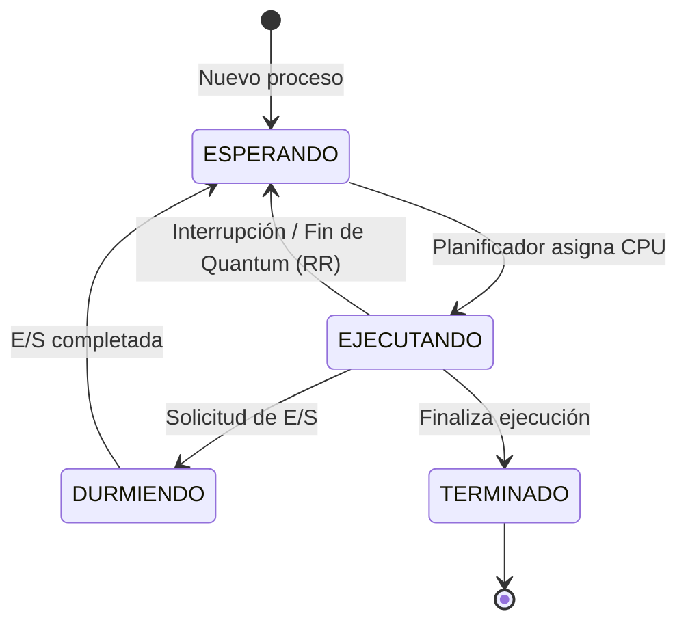

# Algoritmos de Planificación de Procesos

## Introducción al *Process Scheduling* (Planificación de Procesos)
En un sistema operativo moderno, generalmente existen más procesos queriendo ejecutarse que procesadores (CPUs) físicos disponibles. El **Planificador de Procesos** (o *Process Scheduler*) es el componente fundamental del Sistema Operativo responsable de decidir qué proceso en estado de "Listo" debe obtener acceso a la CPU y por cuánto tiempo.

El objetivo de estos algoritmos de planificación es maximizar el aprovechamiento de la CPU, reducir los tiempos de espera para los usuarios, garantizar la equidad entre tareas y evitar que un proceso acapare indefinidamente los recursos de la máquina.

A continuación, se describen conceptualmente tres de las políticas de planificación más reconocidas —**RR (Round Robin)**, **FCFS (First-Come, First-Served)** y **SJF (Shortest Job First)**— junto a su implementación en código.

## Ciclo de Vida y Estados de un Proceso
A lo largo de su ejecución, un proceso transita por diversos estados dependiendo de si tiene los recursos que necesita. En nuestra simulación (y en la mayoría de sistemas reales de forma similar), los estados son:

1. **ESPERANDO (Ready / Listo)**: El proceso tiene todo lo que necesita para trabajar, pero está esperando su turno para que el planificador le asigne una CPU.
2. **EJECUTANDO (Running)**: El proceso se encuentra actualmente dentro de una CPU ejecutando sus instrucciones o procesando datos.
3. **DURMIENDO (Waiting / Blocked)**: El proceso no puede avanzar temporalmente (por ejemplo, porque está esperando un dato de disco duro o una entrada del usuario). En este estado el proceso libera voluntariamente la CPU para que otros puedan usarla.
4. **TERMINADO (Terminated / Exit)**: El proceso ha concluido su ciclo de trabajo completamente y el sistema operativo puede liberar su memoria.



```c
typedef enum {
    ESPERANDO,   // El proceso está listo para usar la CPU
    EJECUTANDO,  // El proceso está actualmente usando la CPU
    DURMIENDO,   // El proceso está bloqueado (ej. esperando E/S)
    TERMINADO    // El proceso ha finalizado su ejecución
} Estado;
```

## 1. FCFS (First-Come, First-Served)
Es el algoritmo más simple. **"El primero que llega, es el primero en ser atendido"**. 
Los procesos se organizan en una cola FIFO (First In, First Out). Una vez que un proceso obtiene la CPU, no la suelta hasta que termina voluntariamente su ejecución o necesita hacer una operación de Entrada/Salida.

> ✅ **Ventaja**: Muy fácil de entender e implementar. No hay interrupciones forzadas (*overhead* bajo).
> ❌ **Desventaja**: Sufre del *Efecto Convoy*, donde procesos cortos tienen que esperar mucho tiempo si quedan detrás de un proceso muy largo.

### Implementación (Búsqueda del proceso más antiguo)
Se busca entre los procesos en estado de espera (`ESPERANDO`) aquel que tenga el menor tiempo de entrada a la cola (`tick_entrada_listo`).

```c
else if (algo == FCFS) {
    // [FIRST-COME, FIRST-SERVED]
    // Buscamos a través de todos los procesos aquel que cumpla dos condiciones:
    // 1. Que esté actualmente en estado ESPERANDO (listo para usar la CPU).
    // 2. Que haya llegado a la cola de espera antes que los demás.
    // Esto se hace encontrando el proceso con la marca de tiempo 'tick_entrada_listo' más pequeña.
    int min_tick = 999999;
    for (int i = 0; i < num_procesos; i++) {
        if (procesos[i].estado == ESPERANDO) {
            if (procesos[i].tick_entrada_listo < min_tick) {
                min_tick = procesos[i].tick_entrada_listo;
                elegido = i; // Guardamos el índice del proceso más antiguo
            }
        }
    }
}
```

## 2. SJF (Shortest Job First)
En este algoritmo, **"El trabajo más corto va primero"**.
El planificador siempre escoge, entre los procesos que están listos para ejecutar, aquel que necesita la menor cantidad de tiempo de CPU para terminar.

> ✅ **Ventaja**: Es el algoritmo matemáticamente óptimo para minimizar el tiempo de espera promedio.
> ❌ **Desventaja**: Es imposible predecir con exactitud cuánto tiempo va a requerir un proceso antes de ejecutarlo. Además, puede causar "inanición" (los procesos largos podrían no ejecutarse nunca).

### Implementación (Búsqueda de la ráfaga más corta)
Se revisan los procesos en espera y se escoge aquel que tenga el menor tiempo restante de CPU (`tiempo_restante_cpu`).

```c
else if (algo == SJF) {
    // [SHORTEST JOB FIRST]
    // El objetivo es encontrar el proceso que requerirá menos trabajo por parte del CPU.
    // Inicializamos min_tiempo con un valor alto y revisamos cada proceso.
    int min_tiempo = 999999;
    for (int i = 0; i < num_procesos; i++) {
        // Solo consideramos los procesos que están listos (ESPERANDO).
        if (procesos[i].estado == ESPERANDO) {
            // Comparamos cuánto tiempo de CPU le falta a este proceso ('tiempo_restante_cpu').
            // Si le falta menos tiempo que al mínimo encontrado hasta ahora, se convierte en nuestro nuevo candidato.
            if (procesos[i].tiempo_restante_cpu < min_tiempo) {
                min_tiempo = procesos[i].tiempo_restante_cpu;
                elegido = i;
            }
        }
    }
}
```

## 3. RR (Round Robin)
A cada proceso se le asigna un **"Quantum"** (una pequeña fracción de tiempo fijo). Los procesos se ponen en una cola circular. La CPU ejecuta cada proceso durante su quantum. Si el proceso no ha terminado al acabarse el quantum, el sistema operativo lo interrumpe, lo pone al final de la cola y le da el turno al siguiente.

> ✅ **Ventaja**: Es muy equitativo (justo). Ningún proceso tiene que esperar demasiado, haciendo que el sistema sea responsivo.
> ❌ **Desventaja**: Un *quantum* muy pequeño causa que la CPU pierda mucho tiempo cambiando de contexto. Un *quantum* gigante degenera el algoritmo a FCFS.

### Implementación (Búsqueda en Cola Circular y Preemptión)
Se revisan los procesos a partir del último que fue revisado (`ultimo_revisado`). Se selecciona el primer proceso en espera que se encuentre y se actualiza el puntero de forma circular.

```c
if (algo == RR) {
    // [ROUND ROBIN] - Implementación de selección en Cola Circular.
    // Para ser justos, iteramos a través de los procesos iniciando justo después del último proceso al que le dimos CPU.
    // 'ultimo_revisado' recuerda dónde nos quedamos en el ciclo anterior.
    for (int i = 0; i < num_procesos; i++) {
        // Usamos el operador módulo (%) para asegurar que la cuenta dé la vuelta (vuelva a 0) 
        // cuando llegamos al final del arreglo, simulando así una estructura circular.
        int idx = (ultimo_revisado + i) % num_procesos;
        
        if (procesos[idx].estado == ESPERANDO) {
            elegido = idx; // Encontramos el siguiente en la ronda
            // Actualizamos el marcador para que en el futuro no busquemos desde el inicio,
            // sino desde el que sigue a este, manteniendo la rotación equitativa.
            ultimo_revisado = (idx + 1) % num_procesos;
            break;
        }
    }
}
```

La interrupción por *Quantum* se maneja durante la ejecución del proceso en la CPU:

```c
else if (algo == RR && procesos[p].tiempo_en_cpu_actual >= QUANTUM) {
    // [PREEMPTION / DESALOJO EN RR]
    // El proceso actual ya consumió su cantidad máxima de tiempo permitida ininterrumpidamente (QUANTUM).
    // El SO debe quitárle forzosamente la CPU para dar turno a otros.
    procesos[p].estado = ESPERANDO;          // Pierde la CPU, vuelve a esperar
    procesos[p].tick_entrada_listo = tiempo; // Le asignamos el tiempo actual, lo que lo envía "al final" de la fila
    proceso_en_cpu[c] = -1;                  // La CPU queda libre para que se asigne al siguiente
}
```

## Tabla Comparativa

| Característica | FCFS (First-Come, First-Served) | SJF (Shortest Job First) | RR (Round Robin) |
| :--- | :--- | :--- | :--- |
| **Criterio de selección** | Tiempo de llegada (orden de cola). | Tiempo estimado de ráfaga de CPU. | Turnos rotativos en una cola (Quantum). |
| **Expropiativo (Interrumpe)**| No (Por lo general). | No (La variante SRTF sí lo es). | Sí (Garantizado por el Quantum). |
| **Equidad** | Media (Procesos cortos sufren). | Baja (Penaliza a los largos). | Alta (Turnos periódicos para todos). |
| **Tiempos de espera** | Altos, impredecibles (Efecto Convoy). | Muy bajos (Óptimo teórico). | Medios / Bajos (Depende del Quantum). |
| **Inanición (Starvation)** | No (Todos terminan eventualmente). | Sí (Los largos pueden ser postergados eternamente). | No (La cola circular garantiza avances). |
| **Caso de uso ideal** | Trabajos en lote (*batch*). | Entornos teóricos o sistemas controlados. | Sistemas operativos modernos e interactivos. |
