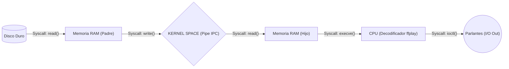

#  Guía de Estudio: Sistemas Operativos (Reproductor MP3)

Bienvenido a la documentación oficial del código `reproductor_mp3.c`. Este proyecto no es un reproductor de música convencional; es un simulador educativo diseñado específicamente para estudiantes de Sistemas Operativos.

Su objetivo principal es demostrar **qué ocurre exactamente dentro del Kernel (Núcleo) de Linux** cuando reproducimos un archivo multimedia, obligándonos a abandonar las cómodas librerías de alto nivel para ensuciarnos las manos con **System Calls** directas.

---

## 1. Arquitectura del Flujo de Datos

Para que una canción suene, los bytes comprimidos en el disco duro deben viajar a través de múltiples capas de hardware y memoria protegida. Nuestra arquitectura se divide de la siguiente manera:



---

## 2. El Problema del Aislamiento y el IPC (Inter-Process Communication)

En sistemas operativos modernos, **los procesos están estrictamente aislados por seguridad**. 
Cuando nuestro código ejecuta `fork()`, el Sistema Operativo crea un proceso "Hijo". Aunque el Hijo nace como un clon del "Padre", cada uno recibe **su propio espacio de Memoria Virtual separada**.

> [!IMPORTANT]
> **¿Por qué no usar RAM normal?**
> Si el proceso Padre lee la canción y la guarda en un puntero global (ej: `char *cancion`), el proceso Hijo **jamás podrá leer esa dirección de memoria**. Si lo intenta, el procesador lanzará una excepción por violación de seguridad conocida como **Segmentation Fault**.

### La Solución: El Pipe (Tubería)
Para poder transferir los bytes de la canción desde el Padre hacia el Hijo sin romper la seguridad del sistema, necesitamos un **IPC (Inter-Process Communication)**.
Usamos la System Call `pipe()`, la cual pide al Sistema Operativo que reserve un búfer circular de memoria oculto **directamente dentro del Kernel Space**.

> [!NOTE]
> **¿El Pipe es Stack o Heap?**
> Ninguno de los dos (para el usuario). Esa memoria no vive en el `malloc` ni en las variables locales de tu programa. Vive en la memoria súper-privilegiada del Sistema Operativo, gestionada internamente a través de `kmalloc`.

---

## 3. La Magia de la Reproducción: La Syscall `execve()`

El código fuente en C **no sabe decodificar MP3**. Hacer la Transformada Inversa de Fourier matemática en C requeriría miles de líneas de código. En su lugar, el Hijo invoca al decodificador `ffplay` usando la llamada al sistema **`execve()`**.

> [!WARNING]
> **¿Qué hace execve() realmente? ¡Destruye y Reemplaza!**
> Muchos estudiantes creen que el proceso hijo "llama" a un programa externo y luego continúa. **Falso**. 
> Al invocar `execve()`, el código C del proceso Hijo **muere instantáneamente**. Su espacio de memoria entero (Text, Data, BSS, Heap, Stack) es **devorado y sobreescrito** por las instrucciones del binario de `ffplay`. A partir de esa línea, el programa C original deja de existir en ese proceso, y `ffplay` toma el control de la CPU.

Dado que antes de morir el Hijo configuró sus File Descriptors usando `dup2()`, `ffplay` "hereda" la conexión al Kernel Pipe, leyendo de él como si fuera el teclado, y usando los drivers de ALSA para hacer vibrar el parlante.

---

## 4. Diccionario de System Calls Empleadas

En este código evitamos funciones como `fopen()` o `system()` de C, ya que son abstracciones (wrappers). En su lugar, hablamos directamente con el Sistema Operativo:

| System Call | Explicación para Estudiantes |
| :--- | :--- |
| `open()` | Pide al Kernel que acceda al controlador del Disco Duro y nos devuelva un "File Descriptor" (un ID numérico). |
| `pipe()` | Le exige al Kernel reservar ~64KB de RAM en su espacio privado para intercomunicar dos procesos. |
| `fork()` | Clona el hilo de ejecución actual en la CPU, creando dos programas idénticos ejecutándose en paralelo. |
| `dup2()` | Modifica la tabla interna de File Descriptors. Lo usamos para engañar al Hijo haciéndole creer que el Pipe es el Teclado (Standard Input 0). |
| `execve()` | Asesina el proceso actual y reemplaza su memoria con un binario nuevo (el reproductor ffplay). |
| `read() / write()` | Mueve físicamente los bytes entre el Disco, los búferes de RAM y el Pipe IPC. |
| `ioctl()` | Input/Output Control. El Padre la usa para espiar cuántos bytes no leídos hay atorados en el Pipe. El Hijo (ffplay) la usa para inyectar configuraciones (frecuencia, canales estéreo) directamente al Driver del parlante. |
| `fcntl()` | File Control. Lo usamos para preguntarle al Kernel qué tamaño exacto le dio a la memoria del Pipe. |
| `sched_getcpu()` | Le pregunta al Planificador del OS (Scheduler) en qué núcleo físico del procesador está ejecutando el hilo en este milisegundo exacto. |

---

## 5. Explicación de los Módulos del Código (`reproductor_mp3.c`)

El código fuente está dividido en funciones modulares. A continuación, analizamos los fragmentos de código más críticos para entender su interacción con el Kernel.

### A. Creación del IPC (La Tubería)
Antes de crear procesos paralelos, necesitamos construir el puente de comunicación.

```c
void modulo_crear_ipc_pipe(int pipefd[2]) {
    // La System Call pipe() reserva memoria en el Kernel Space.
    // Retorna dos File Descriptors: 
    // pipefd[0] -> Para Leer (Boca de salida)
    // pipefd[1] -> Para Escribir (Boca de entrada)
    if (pipe(pipefd) == -1) {
        perror("Error al crear el pipe");
        exit(1);
    }
}
```

### B. El Engaño del Hijo y el Reemplazo (`execve`)
Este es el momento más importante del programa. El proceso hijo redirige sus canales de hardware y se "suicida" para convertirse en el reproductor de audio.

```c
void modulo_hijo_decodificador(int pipefd[2]) {
    close(pipefd[1]); // El hijo no escribe, cerramos la entrada del tubo.

    // 1. EL ENGAÑO (dup2)
    // Cerramos el "Teclado" (fd 0) y lo reemplazamos por la boca de lectura del Pipe.
    // Ahora, todo programa que intente leer del teclado, leerá de nuestro Pipe.
    dup2(pipefd[0], 0); 
    close(pipefd[0]);

    // 2. EL REEMPLAZO (execve)
    // Inyectamos el binario de 'ffplay' en la RAM del proceso actual.
    // El código C muere aquí. 'ffplay' despierta, intenta leer el teclado, 
    // ¡y sin saberlo comienza a chupar la canción desde el Kernel Pipe!
    char *args_ffplay[] = {"/usr/bin/ffplay", "-i", "pipe:0", "-nodisp", "-autoexit", "-hide_banner", "-loglevel", "error", NULL};
    execve("/usr/bin/ffplay", args_ffplay, environ);
}
```

### C. El Bucle del Padre (Transmisión al Kernel)
Mientras el hijo reproduce el sonido, el padre trabaja a máxima velocidad moviendo bloques del disco duro al Pipe.

```c
// Bucle infinito hasta que se acabe el archivo
while ((bytes_read = read(fd_mp3, buffer, BUFFER_SIZE)) > 0) {
    
    // Inyectamos los bytes directamente a la memoria protegida del Kernel
    write(pipefd[1], buffer, bytes_read);
    
    // ¡Espectrómetro de la Terminal!
    // Le preguntamos al Scheduler en qué núcleo físico (Core) está nuestro hilo ahora mismo
    int core_id = sched_getcpu();
    
    // Usamos ioctl() para espiar cuánta memoria del Kernel está ocupando el Pipe
    int bytes_in_pipe = 0;
    ioctl(pipefd[1], FIONREAD, &bytes_in_pipe);
    
    // (A continuación, el código calcula la entropía e imprime la interfaz CLI de la terminal)
}
```

### D. La Orquestación de Procesos (`fork` y `waitpid`)
Todo el trabajo asíncrono se desencadena desde el `main()`. Aquí es donde un programa se divide físicamente en dos.

```c
int main(int argc, char *argv[]) {
    // ... (Configuración del Pipe y apertura del disco)
    
    // Clonación del proceso
    pid_t pid = fork();

    if (pid == 0) {
        // RAM del Hijo: Ejecuta el decodificador
        modulo_hijo_decodificador(pipefd);
    } else {
        // RAM del Padre: Transmite la música al Pipe
        modulo_padre_transmisor(fd_mp3, pipefd);
        
        // El Padre se bloquea y espera a que el Hijo muera/termine
        // Esto evita dejar procesos "Zombie" u "Huérfanos" consumiendo RAM.
        waitpid(pid, NULL, 0); 
    }
}
```

### E. I/O Puro vs Librerías de C (`open` vs `fopen`)
Notarás que para leer el MP3 no usamos un `FILE *` ni `fopen()`. Esas son funciones de la librería estándar de C (stdlib) que crean sus propios búferes intermedios de caché en la RAM del proceso.

Nosotros usamos la llamada POSIX directa **`open()`**. Esto nos devuelve un simple número entero (el File Descriptor) que es un índice directo a la tabla interna del Sistema Operativo apuntando al controlador del disco duro, logrando un acceso sin intermediarios.

### F. El Espectrómetro Visual (Matemática con Entropía)
Como el MP3 viaja en formato binario comprimido por el Pipe, el Padre no sabe qué notas musicales están sonando. Para lograr simular el ecualizador visual de la terminal sin usar librerías de sonido pesadas, el código acude a una trampa brillante: **usar la entropía de los bytes**.

```c
// Tomamos un byte del lado izquierdo del búfer (simulando canal L) y otro del derecho (canal R)
unsigned char byte_L = (unsigned char)buffer[bytes_read / 4];
unsigned char byte_R = (unsigned char)buffer[bytes_read - 10];

// Lo dividimos en módulo 12 (las 12 notas de la escala cromática)
int idx_L = byte_L % 12;

// Usamos el módulo 8 para elegir una de las 8 barras de tamaño (  ▂ ▃ ▄ ▅ ▆ ▇ █ )
int muestra_L = ((unsigned char)buffer[...]) % 8;
```
En lugar de una costosa Transformada Rápida de Fourier (FFT), este bloque demuestra que el ruido y la distribución estadística de un archivo muy comprimido (como un `.mp3`) pueden generar ondas visuales pseudo-aleatorias pero sincronizadas con el flujo de I/O de disco.

Al dominar todos estos bloques, los estudiantes no solo entienden un código, sino cómo los Sistemas Operativos modernos orquestan la multitarea, el aislamiento de memoria, la I/O nativa y la comunicación entre procesos (IPC).
