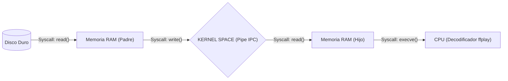
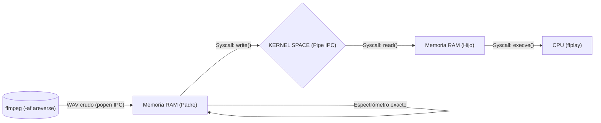

# Guía de Estudio: Sistemas Operativos (Reproductor MP3)

Bienvenido a la documentación oficial del código `reproductor_mp3.c` y su orquestador `main.c`. Este proyecto no es un reproductor de música convencional; es un simulador educativo diseñado específicamente para estudiantes de Sistemas Operativos.

Su objetivo principal es demostrar **qué ocurre exactamente dentro del Kernel (Núcleo) de Linux** cuando reproducimos un archivo multimedia, gestionar comunicación de procesos (IPC), llamadas al sistema, sincronización e interrupciones.

---

## 1. Arquitectura del Flujo de Datos Modular

Para que una canción suene, los bytes deben viajar a través de múltiples capas de memoria y comunicación. El proyecto tiene dos modalidades según el sentido de la reproducción:

### A) Modo Directo (I/O Nativo)
El proceso Padre lee los bytes comprimidos (MP3) directo del disco y los inyecta al Pipe. El Hijo (usando `ffplay`) los chupa de la tubería, los decodifica y reproduce:


### B) Modo Inverso (Redirección IPC avanzada)
Puesto que no se puede reproducir un MP3 al revés en tiempo real sin almacenarlo completo en RAM, usamos un "Hack de IPC" utilizando `popen()`. El Padre levanta un sub-proceso (`ffmpeg`) que decodifica y voltea la canción a formato **WAV PCM descompreso**. El Padre absorbe estos bytes crudos, reaccionando visualmente a sus amplitudes exactas en tiempo real y enviándolos al Hijo:


---

## 2. El Problema del Aislamiento y el IPC (Inter-Process Communication)

En sistemas operativos modernos, **los procesos están estrictamente aislados por seguridad**.
Cuando nuestro código ejecuta `fork()`, el Sistema Operativo crea un proceso "Hijo" con **su propio espacio de Memoria Virtual separada**.

> [!IMPORTANT]
> **¿Por qué no usar RAM normal?**
> Si el proceso Padre lee la canción y la guarda en un puntero global, el proceso Hijo **jamás podrá leer esa dirección de memoria** (lanzaría **Segmentation Fault**). Por eso usamos la Tubería (`pipe()`), una porción de memoria administrada internamente por el Kernel.

---

## 3. Orquestador Dinámico (`main.c`) y Análisis de Señales

El `main.c` no es un simple programa de prueba. Es un **Orquestador Multiproceso** completo con su propio intérprete de línea de comandos. 

Puedes invocarlo así para generar N procesos concurrentes de reproducción:
```bash
./main 'P1{-c: "cancion.mp3", -n: "Lento", -s: 0.5, -C: 32} P2{-d: "inverso", -q}'
```
### Análisis del Ciclo de Vida (`waitpid`)
El orquestador no deja a sus hijos huerfanos. Usa `waitpid()` en conjunto con las Macros POSIX para actuar como supervisor:
- `WIFEXITED`: Detecta si el hijo finalizó exitosamente (la canción terminó).
- `WIFSIGNALED`: Detecta si el hijo fue asesinado (ej. al recibir un SIGINT por presionar `Ctrl+C`).
- `WIFSTOPPED` / `WIFCONTINUED`: Manejo del planificador en segundo plano (`Ctrl+Z`).

---

## 4. Diccionario de System Calls Empleadas

Evitamos funciones de alto nivel (como `fopen`) para usar llamadas directas del Kernel:

| System Call          | Explicación para Estudiantes                                                                                                                                                                                                  |
| :------------------- | :----------------------------------------------------------------------------------------------------------------------------------------------------------------------------------------------------------------------------- |
| `open()`           | Pide al Kernel acceso al controlador del Disco Duro y devuelve un File Descriptor numérico.                                                                                                                 |
| `pipe()`           | Le exige al Kernel reservar memoria en su espacio privado para intercomunicar dos procesos.                                                                                                                               |
| `fork()`           | Clona el hilo de ejecución actual en la CPU, creando programas idénticos ejecutándose en paralelo.                                                                                                                      |
| `dup2()`           | Modifica la tabla de File Descriptors. Lo usamos para engañar al Hijo haciéndole creer que el Pipe es el Teclado (STDIN).                                                                                 |
| `execve()`         | Asesina el proceso actual y reemplaza su memoria por completo con el binario del decodificador (`ffplay`).                                                                                                                                 |
| `ioctl()`          | *Input/Output Control*. El Padre la usa para espiar cuántos bytes no leídos hay atorados en el Pipe. |
| `sched_getcpu()`   | Consulta al Planificador del OS (Scheduler) en qué núcleo físico del procesador estamos ejecutando.                                                                                     |
| `clock_gettime()`   | Consulta el reloj monotónico del Kernel para gestionar los contadores de tiempo en tiempo real o cronómetros regresivos independientemente de los lags.                                                                                     |

---

## 5. Módulo del Espectrómetro y Control de Consola ANSI

Debido a que `main.c` lanza múltiples procesos que intentan imprimir en la misma terminal, usamos control del cursor mediante secuencias de escape ANSI (`\033[%dA`). 
A cada proceso se le asigna dinámicamente una "línea de desplazamiento" (`offset`). 

Cada iteración del Padre:
1. Guarda la posición del cursor (`\033[s`)
2. Sube N líneas (`\033[NA`) y retorna al inicio (`\r`)
3. Imprime su barra visualizadora, CPU, tiempo y estatus.
4. Borra el residuo de la línea (`\033[K`)
5. Restaura la posición del cursor (`\033[u`)

¡Esta técnica asegura que los diferentes monitores multiprocesos de la terminal jamás parpadeen ni colisionen entre sí!
